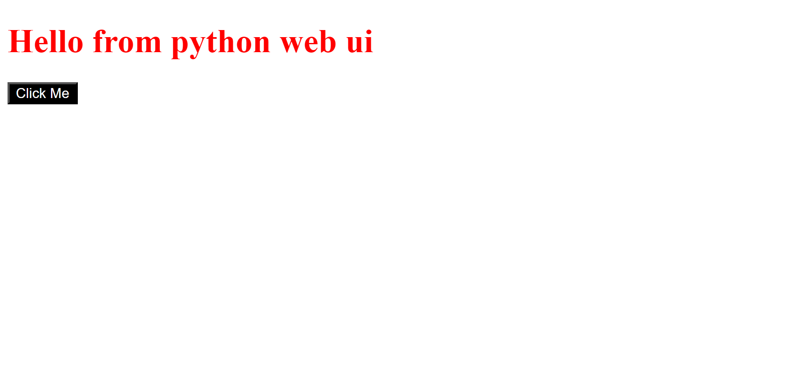
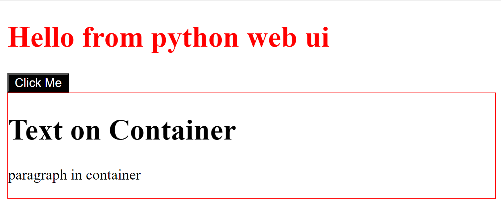
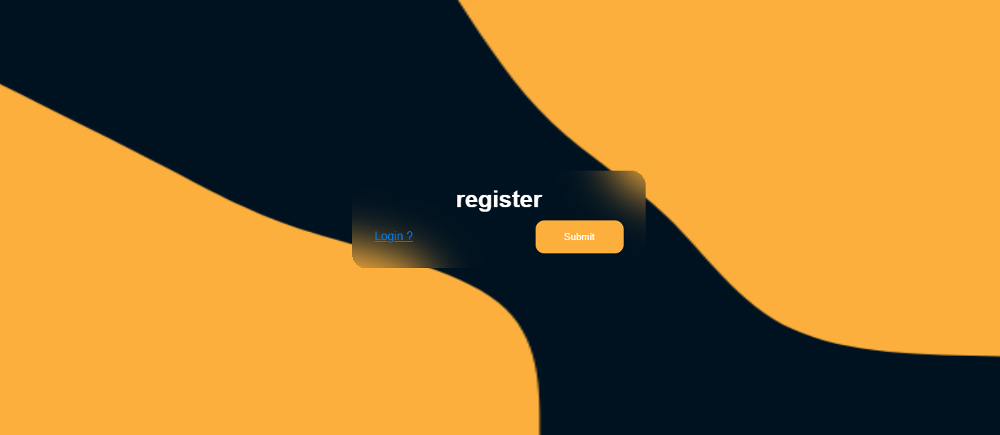
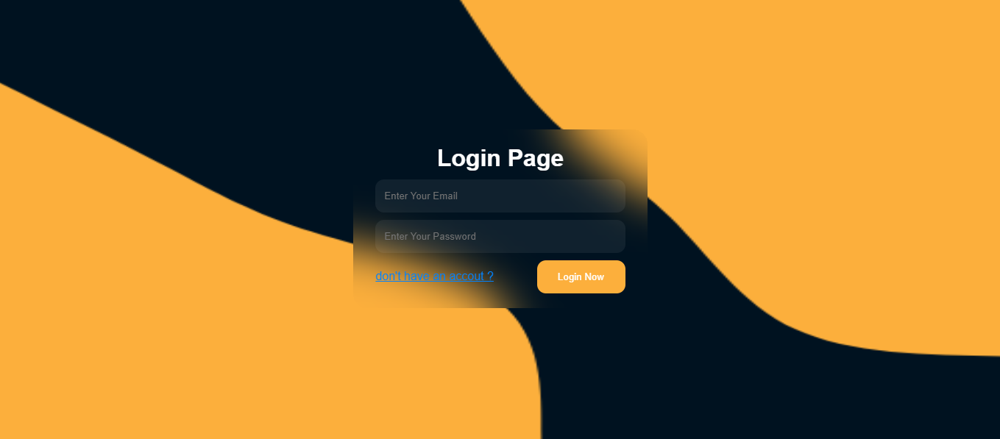

### Complete guide for pythonwebui lib.

## intro :
### pythonwebui is a library to build your web pages using only python code, you can build components and connect this components which each other .
---

## who can use this lib
1. a python coder ♥️
2. specfic on backend 🧑‍💻
3. already know html and css with their attrs and tags 🫡
4. if u don't waste your time write html code
5. the main purpose of building this lib is at the end of this article.

<br>
<br>

# Let's Start 🔥

<br>
<br>

### How is it work

### Install the library from github
```
git clone <repo-link>
```

```
cd pythonwebui
```

```
code .
```

### Create your python file and open it, then write.
```python
from pythonwebui.page import Page
from pythonwebui.components.elements import Button, Div, H1

# init the page
page = Page('Your title Here')
root = page.body

# append elements to body page
root.childs = [

    # insert h1 to the page
    H1(
        text='Hello from python web ui',
        class_name='myclassname',
        id_name='myidname',
        stylesheet={
            'color' : 'red'
        }   
    ),

    # insert button to the page
    Button(
        text='Click Me',
        tags={
            'type' : "button"
        },
        stylesheet={
            'background-color' : "#000",
            'color' : '#fff',
        }
    )

]

# save the output
page.save('my-html-file.html')

```

### The Output :


---

### Now let's build a component and append it to the root.

```python
from pythonwebui.page import Page
from pythonwebui.components.elements import Button, Div, H1, P

# init the page
page = Page('Your title Here')
root = page.body

# create container div
my_container = Div(
    class_name='container',
    stylesheet={
        'border' : '1px solid red'
    }
)

# append elemetns to container div
my_container.append_child([
    H1(
        text='Text on Container'
    ),

    P(
        text='paragraph in container'
    )

])

# append elements to body page
root.childs = [

    # insert h1 to the page
    H1(
        text='Hello from python web ui',
        class_name='myclassname',
        id_name='myidname',
        stylesheet={
            'color' : 'red'
        }   
    ),

    # insert button to the page
    Button(
        text='Click Me',
        tags={
            'type' : "button"
        },
        stylesheet={
            'background-color' : "#000",
            'color' : '#fff',
        }
    ),

    # add the div with its childs to the root
    my_container
    ,

]

# save the output
page.save('my-html-file.html')
```


### The Output :



---

# Write css code.
### you can write css code using stylesheet attribute like

```python
from pythonwebui.page import Page
from pythonwebui.components.elements import Button, Div, H1, P

# init the page
page = Page('Your title Here')
root = page.body


# append elements to body page
root.childs = [

    # insert h1 to the page
    H1(
        text='Hello from python web ui',
        class_name='myclassname',
        id_name='myidname',
        # write css attribtues for element
        stylesheet={ 
            'color' : 'red'
        }   
    ),


]

# save the output
page.save('my-html-file.html')

```

### Or you can use Style element

```python
from pythonwebui.page import Page
from pythonwebui.components.elements import Button, Div, H1, P
from pythonwebui.components.stylesheet import Style

# init the page
page = Page('Your title Here')
root = page.body


CSS_STYLE = {
    # the attribute class or id or name
    '.myclassname' : {
        # write css properites here
        'color' : 'red',
    }
}

# append elements to body page
root.childs = [

    # connect the style with the page
    Style(
        attr=CSS_STYLE
    ),

    # insert h1 to the page
    H1(
        text='Hello from python web ui',
        class_name='myclassname',
        id_name='myidname',

    ),

]

# save the output
page.save('my-html-file.html')
```

---
# Use Screens 
### You Can build a full page with custom attributes and elements using only 3 line of code !

```python
from pythonwebui.screens.root import RootScreen
root = RootScreen()
page = root.page()
page.save('my-html-file.html')
```

### Output : 



### Let's add our atts to this page 

```python
from pythonwebui.screens.root import RootScreen
root = RootScreen()

# chage the page title
root.MetaPage.title = 'login page'

# change the h1 text
root.h1.text = 'Login Page'

# append email input
root.input.append_child(
    index=0,
    name='email',
    placeholder='Enter Your Email',
    type_='email'
)

# append password input
root.input.append_child(
    index=1,
    name='password',
    placeholder='Enter Your Password',
    type_='password'
)

# update submit button text
root.submit_button.text = 'Login Now'

# update hyperlink attrs
root.hyperlink.text = "don't have an accout ?"
root.hyperlink.href = 'Your URL'

# save the page
page = root.page()
page.save('my-html-file.html')
```


### Output : 



```python
# you can also change the background image source using 
root.bg_img.src = '<path-to-img>'
```

---

# The main purpose of build this lib is for python coders in backend and they need to build html pages but wihout wast time on html codes, you can use the root pages which is on the lib to build the page depends on the attrs you enter.